# GoType

Бесплатная, многопользовательская лучшая в мире игра! Попробуйте натренировать свою скорость печати, и стать лучшим
по скорости печати.

## Ссылка на скачивание, версия 1.1

|[Windows](https://github.com/Gadzet005/GoType/releases/download/gotype-1.1/GoType-win-x64.exe) | [Linux](https://github.com/Gadzet005/GoType/releases/download/gotype-1.1/GoType-linux.AppImage) | [MacOS](https://github.com/Gadzet005/GoType/releases/download/gotype-1.1/GoType-mac.dmg) |
|-------------------------|------------------------|------------------------| 

## Ссылка на сайт

### [Рейтинг игроков](http://158.160.145.165:5173/rating)

## Backend API

### [Ссылка на Swagger](http://158.160.179.2:8080/swagger/index.html)

## Помощь 

### [Почта поддержки](gotypesup@gmail.com)

## Описание проекта

Проект был развернут в Yandex Cloud и находился в публичном доступе. 

### Веб-сайт

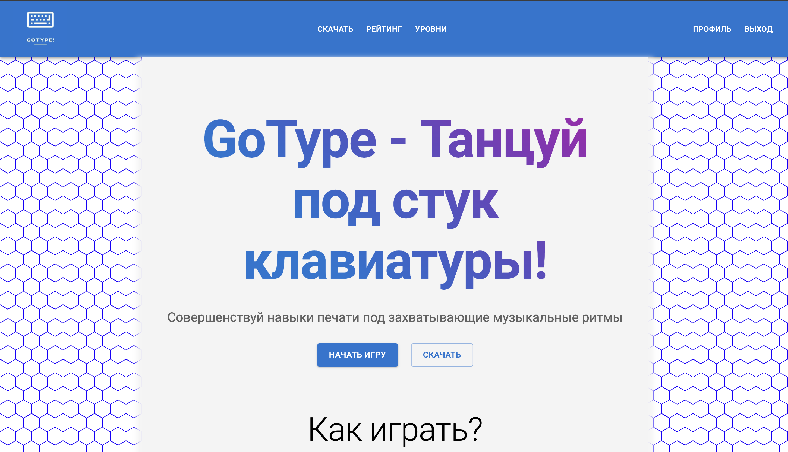

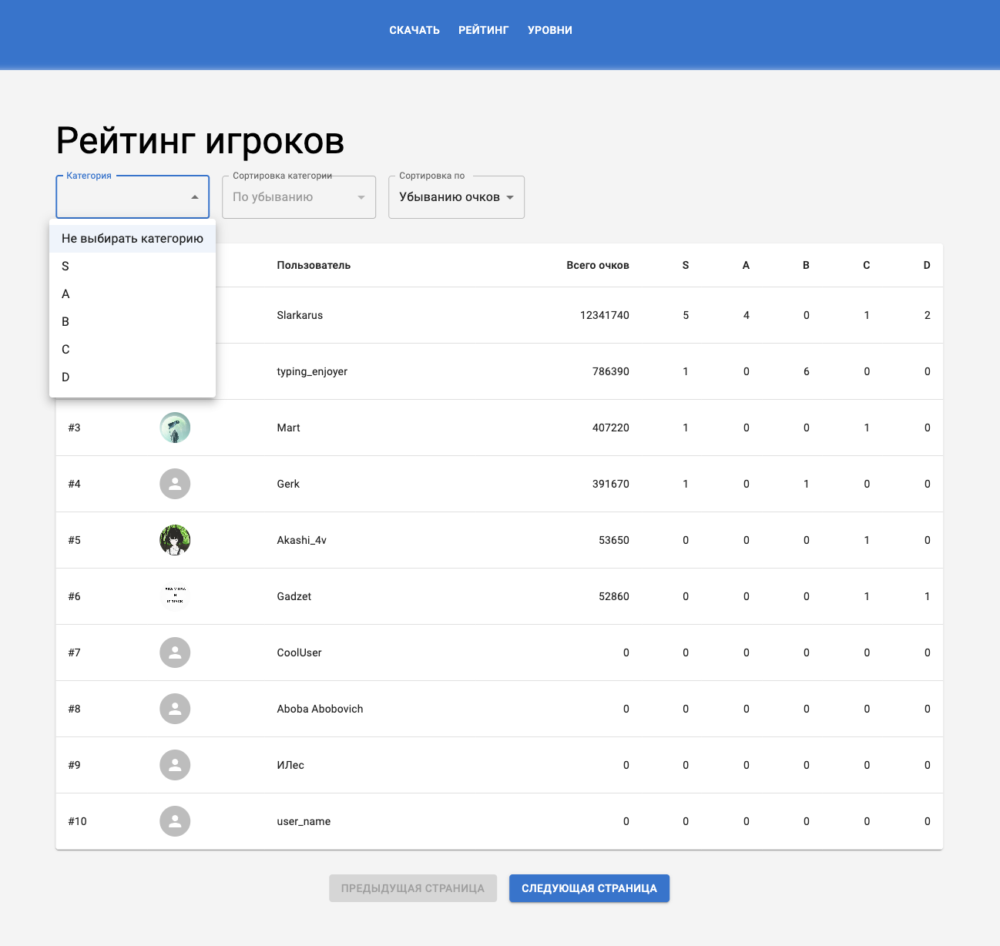

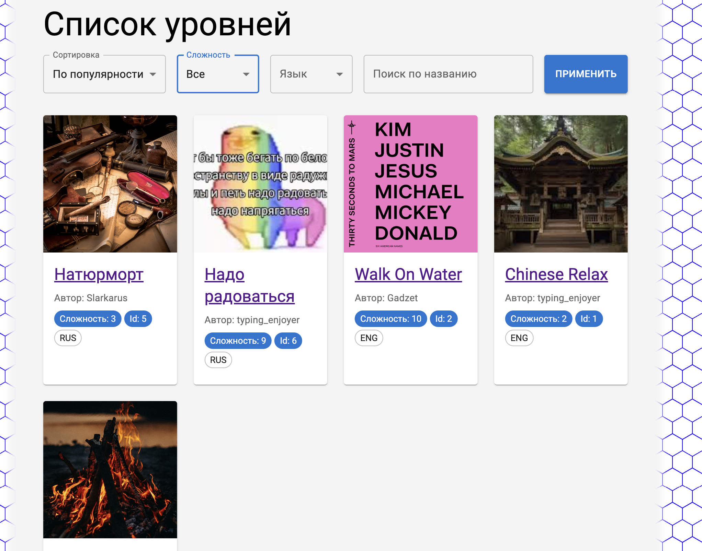

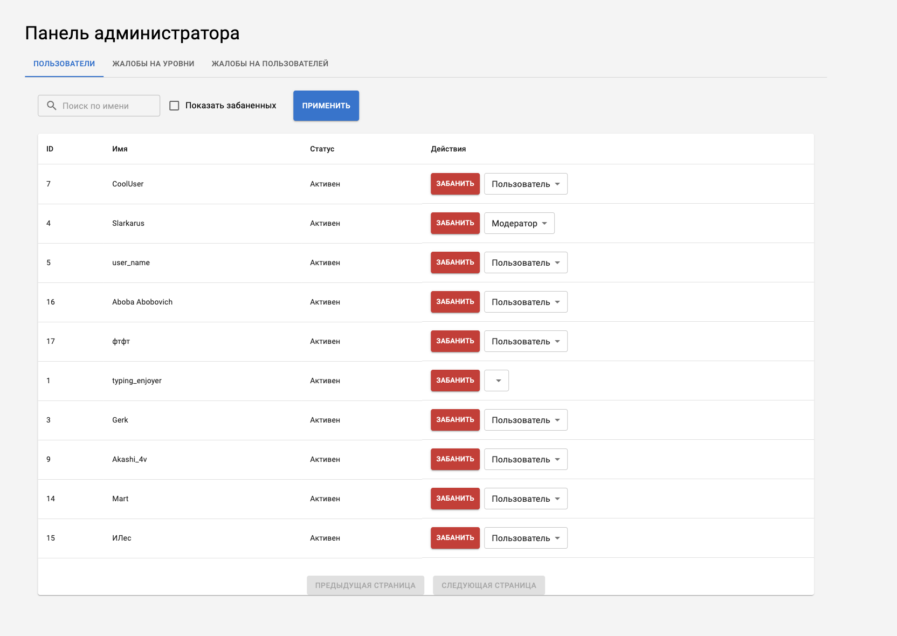

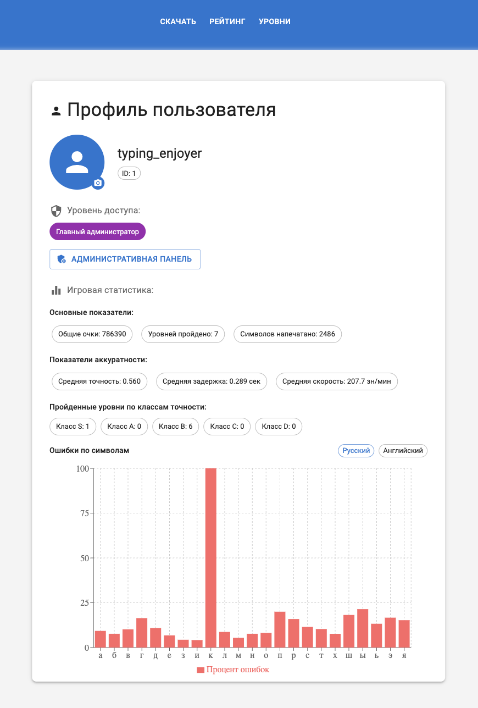

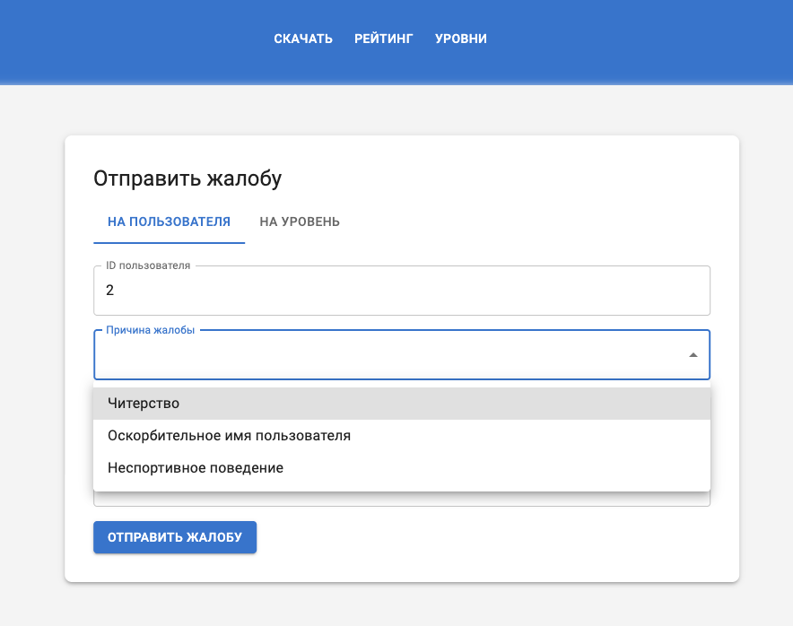

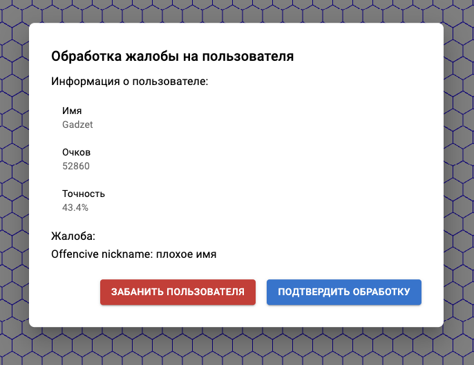

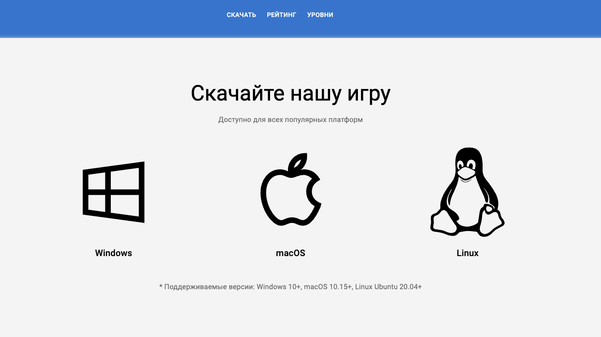

### Десктоп-приложение

Приложение было доступно на macos, windows и linux. 

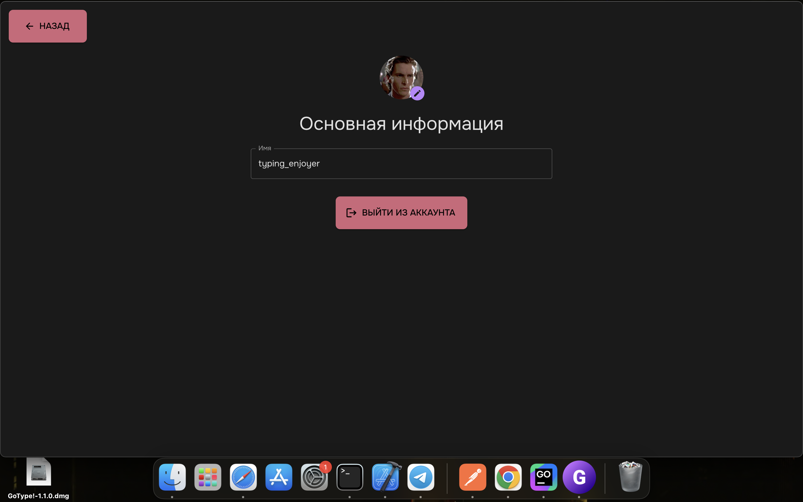

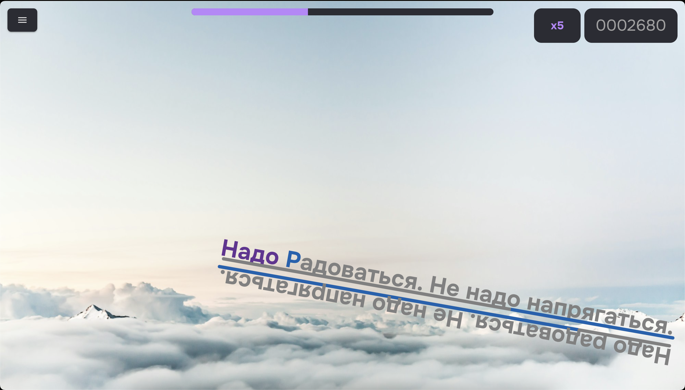

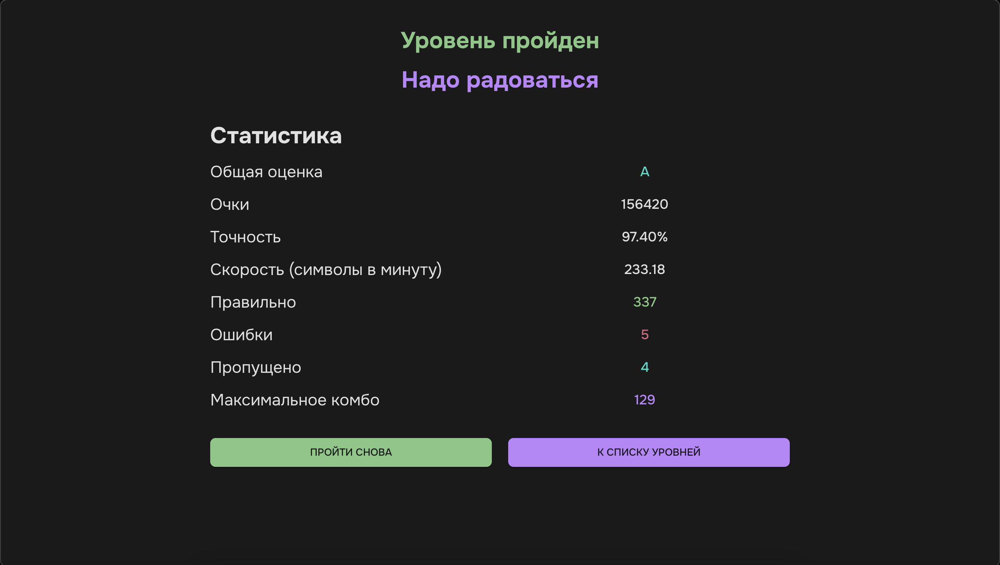

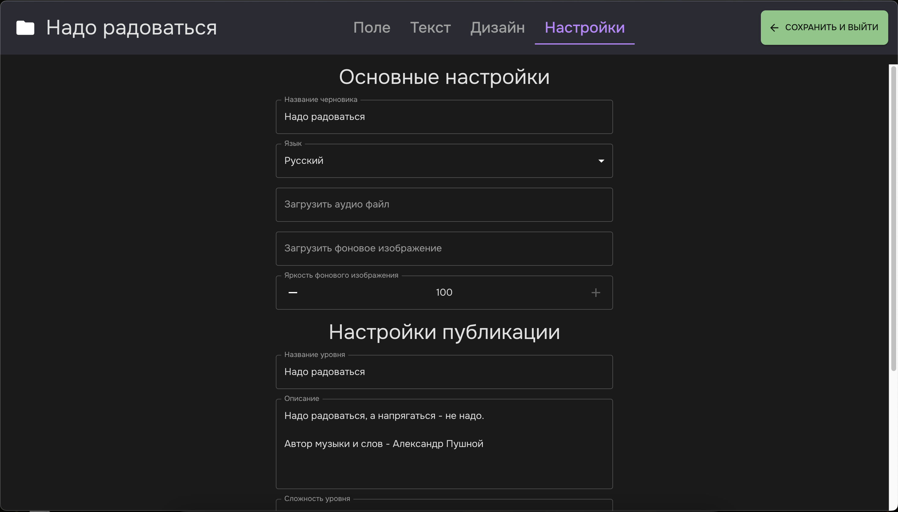

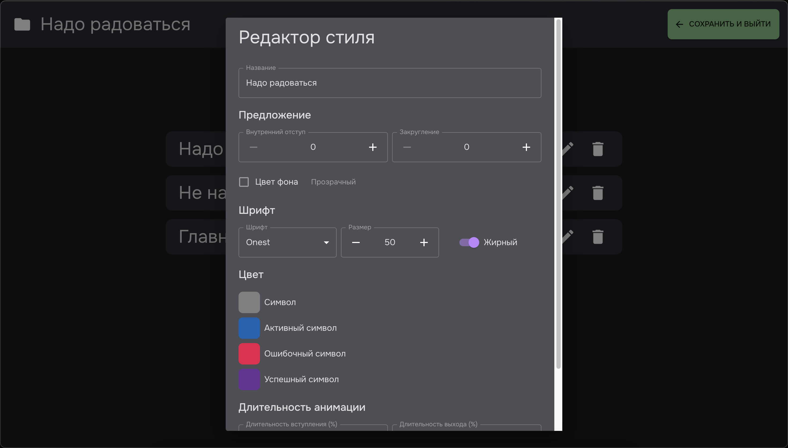

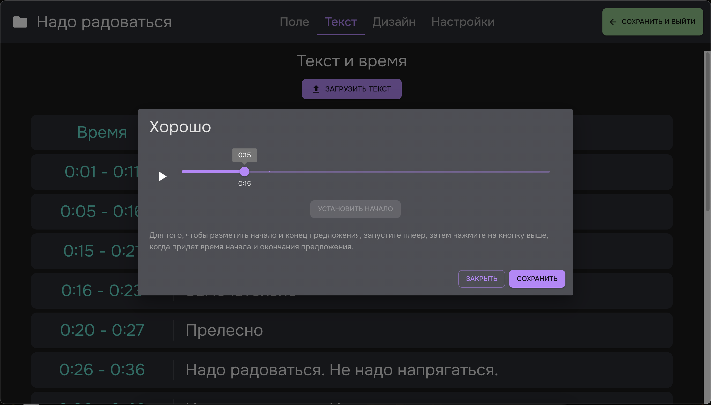

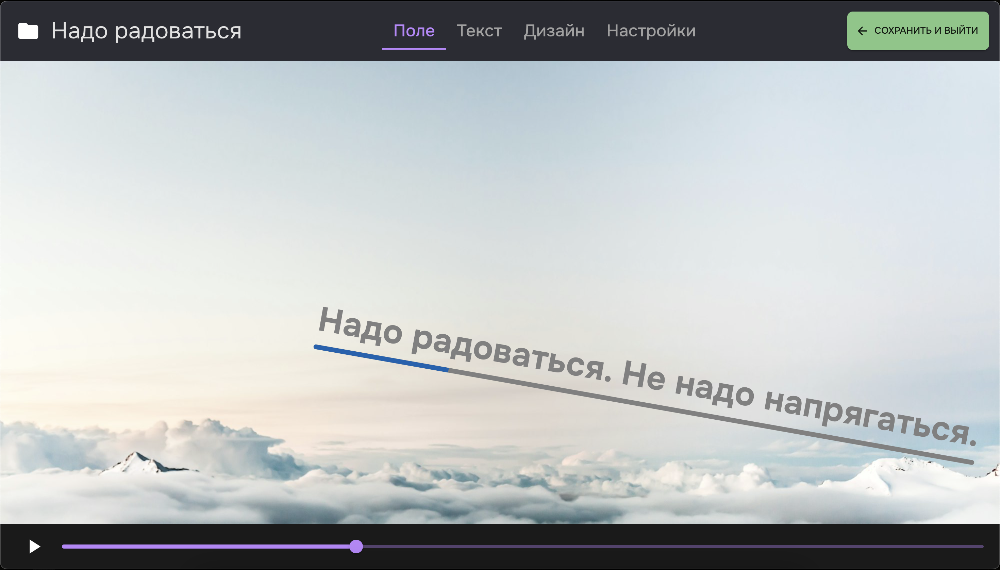

### Бэкенд

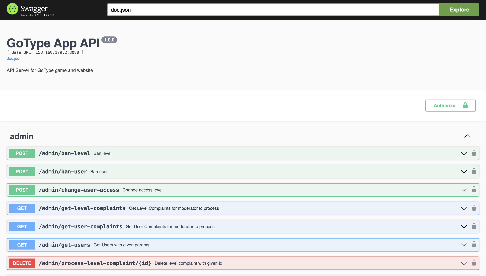

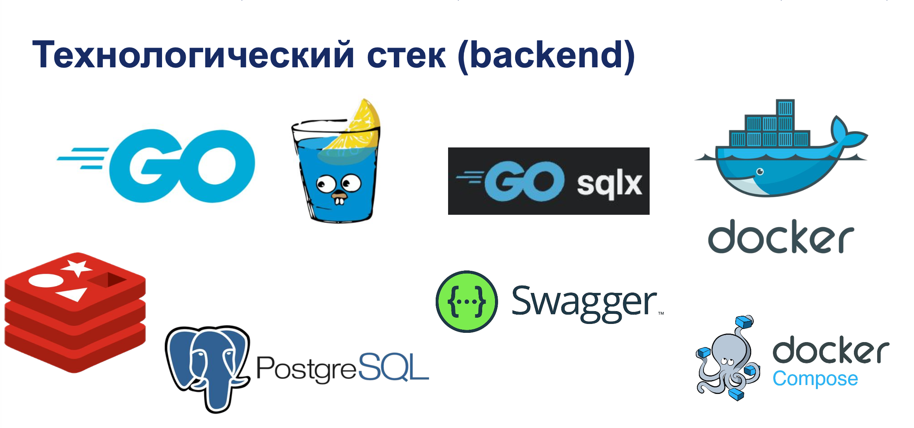